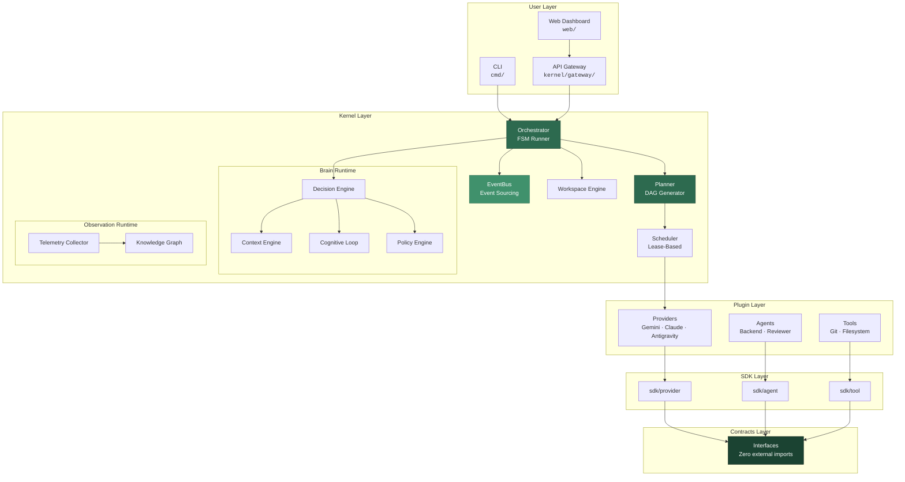

# 🗺️ AEOS Roadmap

> **AI Engineering Operating System** — an Orchestrator + Second Brain that learns from execution history.
> Brain = Go Logic (Rule Engine + Knowledge Graph). AI = content-generation tool.

---

## Vision

AEOS is a deterministic, local-first operating system for AI-assisted software engineering. It coordinates multiple AI coding agents through a Go kernel, manages execution via finite state machines, and continuously improves through a cognitive feedback loop — all while treating AI as a tool, never as the source of truth.

### Core Design Principles

- **17 Immutable Axioms** ([ADP](docs/adp.md)) govern all architectural decisions
- **57 RFCs** define the complete system specification ([RFC Index](docs/rfcs/README.md))
- **4 Runtimes**: Execution, Brain, Plugin, Observation
- **Mission as Aggregate Root**: all tasks, events, decisions, artifacts trace to a single `MissionID`
- **Hexagonal Architecture**: `contracts/` → `kernel/` → `sdk/` → `plugins/` → `modules/` → `cmd/`

---

## Phase Overview

```mermaid
graph LR
    P1["Phase 1<br/>Contracts & Interfaces<br/><i>Weeks 1–2</i>"]
    P2["Phase 2<br/>Kernel Core<br/><i>Weeks 3–6</i>"]
    P3["Phase 3<br/>Plugin SDK<br/><i>Weeks 7–8</i>"]
    P4["Phase 4<br/>Providers & Agents<br/><i>Weeks 9–11</i>"]
    P5["Phase 5<br/>Orchestration & Cognitive Loop<br/><i>Weeks 12–14</i>"]
    P6["Phase 6<br/>CLI, API & Polish<br/><i>Weeks 15–18</i>"]
    P7["Phase 7<br/>57-RFC Evolution<br/><i>Future</i>"]

    P1 --> P2 --> P3 --> P4 --> P5 --> P6 --> P7

    style P1 fill:#2d6a4f,stroke:#1b4332,color:#fff
    style P2 fill:#40916c,stroke:#2d6a4f,color:#fff
    style P3 fill:#52b788,stroke:#40916c,color:#fff
    style P4 fill:#74c69d,stroke:#52b788,color:#000
    style P5 fill:#95d5b2,stroke:#74c69d,color:#000
    style P6 fill:#b7e4c7,stroke:#95d5b2,color:#000
    style P7 fill:#d8f3dc,stroke:#b7e4c7,color:#000
```



---

## Current Status

| Phase | Status | Progress |
|-------|--------|----------|
| Phase 1 | 🔄 In Progress | 4/40 micro-tasks completed |
| Phase 2 | ⏳ Pending | — |
| Phase 3 | ⏳ Pending | — |
| Phase 4 | ⏳ Pending | — |
| Phase 5 | ⏳ Pending | — |
| Phase 6 | ⏳ Pending | — |
| Phase 7 | 📋 Drafted | 43 RFC specs registered |

---

## Phase 1: Contracts & Interfaces — _Weeks 1–2_

> [!IMPORTANT]
> All contracts must remain independent — zero external imports, zero cross-layer dependencies. This guarantees plugin backward compatibility for the lifetime of the system.

**Goal**: Define every interface the system will ever depend on. No implementation code — only types, interfaces, enums, and error sentinels.

### Deliverables

| Area | Package | Key Types |
|------|---------|-----------|
| FSM & Events | `contracts/fsm/`, `contracts/event/` | `Machine`, `State`, `Transition`, `Event`, `Bus`, `Handler` |
| Mission | `contracts/mission/` | `Mission` aggregate root |
| Memory & Knowledge | `contracts/memory/`, `contracts/knowledge/` | `WorkingMemory`, `KnowledgeGraph`, `NodeStore`, `EdgeStore` |
| History & Artifacts | `contracts/history/`, `contracts/artifact/` | `Timeline`, `ArtifactStore` |
| Brain | `contracts/brain/` | `Brain`, `DecisionEngine`, `PlanningEngine`, `PolicyEngine`, `ContextEngine`, `ReflectionEngine`, `LearningEngine` |
| Plugin & Provider | `contracts/plugin/`, `contracts/provider/` | `Plugin`, `PluginMetadata`, `APIProvider`, `CLIProvider`, `StreamingAPIProvider` |
| Agent & Tool | `contracts/agent/`, `contracts/tool/` | `Agent`, `Tool`, `ToolSchema` |
| Workspace | `contracts/workspace/` | `WorkspaceEngine`, `ProjectMetadata`, `GitDetails` |
| Shared | `contracts/errors.go`, `contracts/types.go`, `contracts/status.go` | Sentinel errors, type-safe IDs, execution state enums |

### Completed ✅

- `contracts/errors.go` — sentinel errors
- `contracts/types.go` — type-safe ID types and generation helpers
- `contracts/status.go` — execution state enums and validation
- `contracts/provider/message.go` — chat message structures and roles

### References

- [Phase 1 Spec](docs/tasks/pending/phase1_contracts_foundation.md) · [Phase 1 Micro-tasks](docs/tasks/pending/phase1/)
- Related RFCs: RFC-0000 through RFC-0013

---

## Phase 2: Kernel Core & Shared Services — _Weeks 3–6_

**Goal**: Build the engine. Implement the four runtimes, event sourcing, scheduler, and all core infrastructure that plugins will depend on.

### Deliverables

| Task | Package | Description |
|------|---------|-------------|
| 2.1 | `kernel/config/`, `kernel/logger/` | YAML config loader with env overrides, `slog` structured logger with automatic secret redaction |
| 2.2 | `kernel/eventbus/` | In-memory pub/sub with wildcard topics, SQLite append-only Event Store, state memento snapshots (every 100 events), cryptographic hash chaining (RFC-0028) |
| 2.3 | `kernel/scheduler/` | Lease-based task scheduler with worker heartbeats, task preemption, bounded concurrency via `errgroup.SetLimit` |
| 2.4 | `kernel/plugin/` | Generic `Registry[T]` with thread-safe capability indexing, plugin lifecycle management |
| 2.5 | `kernel/execution/` | Execution runtime, task executor loops, OS process spawner (StdIO capture), token bucket rate-limiting, CPU/RAM monitors |
| 2.6 | `kernel/brain/` | Brain runtime, rule-based decision engine, context assemblers, AST rankers, policy security guards |
| 2.7 | `kernel/workspace/` | Language autodetection, Git status adapters, build toolchain triggers, workspace snapshots & deterministic replay |
| 2.8 | `kernel/observation/` | Observation runtime, telemetry collector (AST changes, git diffs, test results), async knowledge updates |

### References

- [Phase 2 Spec](docs/tasks/pending/phase2_kernel_core.md)
- Related RFCs: RFC-0001, RFC-0008, RFC-0009, RFC-0011, RFC-0013, RFC-0016, RFC-0017, RFC-0028

---

## Phase 3: Plugin SDK — _Weeks 7–8_

**Goal**: Provide a developer kit so that writing new providers, tools, and agents is fast and safe. The SDK imports only from `contracts/`.

### Deliverables

| Task | Package | Description |
|------|---------|-------------|
| 3.1 | `sdk/provider/` | Base process executor wrapping `os/exec`, stdin/stdout/stderr multiplexing, Windows `\r\n` normalizer |
| 3.2 | `sdk/tool/`, `sdk/security/` | Wazero WASM sandbox (64MB memory cap, deny-by-default capabilities), JSON schema input validator, workspace lock integration (RFC-0047) |
| 3.3 | `sdk/agent/` | `BaseAgent` with YAML manifest parsing and prompt template loading |
| 3.4 | `sdk/plugin/` | Common plugin base helpers and lifecycle hooks |

### References

- [Phase 3 Spec](docs/tasks/pending/phase3_plugin_system.md)
- Related RFCs: RFC-0006, RFC-0007, RFC-0023

---

## Phase 4: Providers & Agents — _Weeks 9–11_

**Goal**: Connect the kernel to real AI coding platforms and build the first concrete agent plugins. All plugins import only `contracts/` and `sdk/`.

### Deliverables

| Task | Package | Description |
|------|---------|-------------|
| 4.1 | `plugins/providers/claude/` | Claude Code CLI provider — process spawning, diff parser, structured `Response` extraction |
| 4.2 | `plugins/providers/antigravity/` | Antigravity CLI provider — process multiplexing, stream parser, Windows pipe normalization |
| 4.3 | `plugins/providers/gemini/` | Gemini REST API provider — `APIProvider` and `StreamingAPIProvider` implementation |
| 4.4 | `plugins/tools/` | Filesystem tools (`read_file`, `write_file`), Git tools (`git_commit`), workspace transaction integration (RFC-0047), WASM-sandboxed compilation tools |
| 4.5 | `plugins/agents/backend/` | Backend agent — generates endpoints, structures, tests |
| 4.6 | `plugins/agents/reviewer/` | Reviewer agent — security and quality auditing |

### References

- [Phase 4 Spec](docs/tasks/pending/phase4_provider_agent.md)
- Related RFCs: RFC-0007, RFC-0012, RFC-0023, RFC-0047

---

## Phase 5: Orchestration & Cognitive Loop — _Weeks 12–14_

**Goal**: Build the brain of the system. The master planner decomposes goals into scored DAGs, the FSM runner coordinates execution, and the cognitive loop learns from every mission.

### Deliverables

| Task | Package | Description |
|------|---------|-------------|
| 5.1 | `kernel/planner/` | Goal decomposer, CSP constraint filter, Beam Search DAG generator, Pareto frontier scoring, UCB-1 exploration bonus, contrastive explainable rationale, adaptive replanning on failure (RFC-0037) |
| 5.2 | `kernel/orchestrator/` | FSM runner (`Created → Planning → Running → Validating → Completed/Failed`), workspace transaction checkpoints (RFC-0047), DoD validation gate with multi-dimensional quality scorecard (RFC-0015, RFC-0034) |
| 5.3 | `kernel/brain/cognitive/` | Self-improving cognitive loop: reflection, EMA learning, experience scoring, pattern mining (Saga, Outbox, Repository), meta-thinking, 9-stage truth pipeline, skill trees, cost monitoring, plan caching, ADR records |

### The Scoring Formula

```
Score(Pᵢ) = w_quality·Q(Pᵢ) + w_cost·C(Pᵢ) + w_time·T(Pᵢ) + w_confidence·Conf(Pᵢ) − w_risk·R(Pᵢ)
```

### References

- [Phase 5 Spec](docs/tasks/pending/phase5_orchestration.md)
- Related RFCs: RFC-0010, RFC-0011, RFC-0015, RFC-0030, RFC-0031, RFC-0032, RFC-0034, RFC-0037, RFC-0046

---

## Phase 6: CLI, API & Polish — _Weeks 15–18_

**Goal**: Ship a usable product. REST/WebSocket gateways for real-time monitoring, a Cobra CLI for terminal control, and end-to-end verification.

### Deliverables

| Task | Package | Description |
|------|---------|-------------|
| 6.1 | `kernel/gateway/` | REST API (`/api/v1/health`, `/api/v1/missions`), WebSocket real-time event stream (`/ws/missions/{id}`), time-travel inspector (RFC-0054) |
| 6.2 | `cmd/orchestrator/` | Cobra CLI: `orchestrator --version`, `config init`, `config show`, `agents list`, `providers list`, `verify-reproducibility` (RFC-0049) |
| 6.3 | `web/` | Mission control dashboard — real-time DAG visualization, agent execution displays, trajectory views |

### Quality Gates

All of the following must pass with zero warnings before release:

```bash
go fmt ./...
go vet ./...
golangci-lint run ./...
go build ./...
go test ./...
go test -race ./...
```

### References

- [Phase 6 Spec](docs/tasks/pending/phase6_cli_api_polish.md)
- Related RFCs: RFC-0024, RFC-0029, RFC-0049, RFC-0054

---

## Phase 7: Extended Evolutionary Roadmap — _Future_

> [!NOTE]
> Phase 7 extends the system with 43 additional RFCs (RFC-0014 through RFC-0056), grouped into four evolutionary tracks.

### Track A: Quality, Verification & Debugging

| RFC | Feature |
|-----|---------|
| RFC-0014 | Quality Engine & Verification Pipelines |
| RFC-0015 | Definition of Done (DoD) Engine |
| RFC-0034 | Advanced Quality Engine (multi-dimensional scorecard) |
| RFC-0036 | Mission Simulation & Dry-Run Planner |
| RFC-0049 | Benchmark Framework (comparative planner metrics) |
| RFC-0050 | Policy Simulator (dry-run old plans against new policies) |
| RFC-0054 | Time Travel Debugging (read-only FSM replay) |

### Track B: Intelligence, Learning & Economics

| RFC | Feature |
|-----|---------|
| RFC-0016 | Observation Runtime & Telemetry Collector |
| RFC-0018 | Cost Engine & Planning Cache |
| RFC-0030 | Goal Engine (Goal → Objectives → Constraints → Milestones) |
| RFC-0031 | World Model (Workspace Ontology & Object Schema Mapping) |
| RFC-0032 | Skill Graph (Dynamic Tech Dependencies) |
| RFC-0033 | Confidence Engine (Agent Self-Awareness & Routing Escalation) |
| RFC-0039 | Evolution Engine (Planner Learning from Success Metrics) |
| RFC-0040 | Intent Engine (Business Targets & Priority Constraints) |
| RFC-0041 | Product Memory (Business Ontologies: Vouchers, Flash Sales) |
| RFC-0044 | Economic Engine (ROI & Bug Risk Coefficients) |
| RFC-0051 | Knowledge Decay & TTL (Confidence Decay for Outdated Nodes) |
| RFC-0056 | Trust Engine (Dynamic Provider Trust Ratings) |

### Track C: Workforce, Agents & Collaboration

| RFC | Feature |
|-----|---------|
| RFC-0020 | Agent Capabilities & Skill Tree Metrics |
| RFC-0022 | Multi-Agent Collaboration & Event Routing |
| RFC-0035 | Capability Graph & Agent Competency Model |
| RFC-0037 | Adaptive Recovery & Replanning Engine |
| RFC-0042 | Product Manager Runtime (Requirement Translation) |
| RFC-0043 | Release Intelligence (Canary Loops & Auto-Rollbacks) |
| RFC-0045 | Digital Workforce (Virtual Employee Competency Models) |
| RFC-0048 | Prompt Registry (Version Control & Prompt Benchmarking) |

### Track D: Infrastructure, Security & Scale

| RFC | Feature |
|-----|---------|
| RFC-0017 | Workspace Snapshots & Deterministic Replay |
| RFC-0019 | ADR & Policy Versioning |
| RFC-0021 | Vector Search & Local Graph Embeddings |
| RFC-0023 | Process Sandboxing & Container Isolation |
| RFC-0024 | API Gateways (gRPC, REST, WebSockets) |
| RFC-0025 | Dependency Tree & AST Parser |
| RFC-0026 | Benchmark & Runtime Profiling |
| RFC-0027 | Resilience, Circuit Breakers & Backoffs |
| RFC-0028 | Audit Trail & Cryptographic Event Logs |
| RFC-0029 | Web UI & Mission Control Protocol |
| RFC-0038 | Resource Planning & Budget Estimation |
| RFC-0046 | Execution Graph Manager (Dynamic DAG Merge & Versioning) |
| RFC-0047 | Workspace Transaction Engine (Git-backed Rollbacks) |
| RFC-0052 | Distributed Mission (Event Store Streaming to Remote Nodes) |
| RFC-0053 | Artifact Lineage (Cryptographic Provenance Tracing) |
| RFC-0055 | Multi-Workspace (Hierarchical Submodules & Dependencies) |

---

## Architecture Reference



---

## Key Milestones

| Milestone | Target | Criteria |
|-----------|--------|----------|
| **M1**: All contracts compile | End of Week 2 | `go build ./contracts/...` — zero errors |
| **M2**: Kernel boots with EventBus | End of Week 6 | Events publish/subscribe successfully, SQLite Event Store persists |
| **M3**: First agent executes a task | End of Week 11 | A provider spawns, executes a prompt, returns structured output |
| **M4**: End-to-end mission completes | End of Week 14 | Full FSM lifecycle: Created → Planning → Running → Validating → Completed |
| **M5**: CLI + Dashboard ship | End of Week 18 | `orchestrator run "goal"` works, Web UI shows real-time DAG |
| **M6**: Cognitive loop self-improves | Phase 7 | EMA scores improve across consecutive missions |

---

## Technology Stack

| Component | Technology |
|-----------|-----------|
| Language | Go 1.26 |
| Persistence | SQLite (standard library) |
| Logging | `log/slog` (structured, no third-party) |
| Concurrency | `errgroup.SetLimit`, centralized runtimes |
| Sandboxing | Wazero (WASM), Docker (containers) |
| CLI | Cobra |
| API | net/http (REST + WebSocket) |
| Frontend | Web dashboard (`web/`) |
| VCS Integration | Native Git |

---

## Contributing

See [CONTRIBUTING.md](CONTRIBUTING.md) for development guidelines and the [ADP Constitution](docs/adp.md) for architectural constraints.

---

_Last updated: 2026-07-03_
