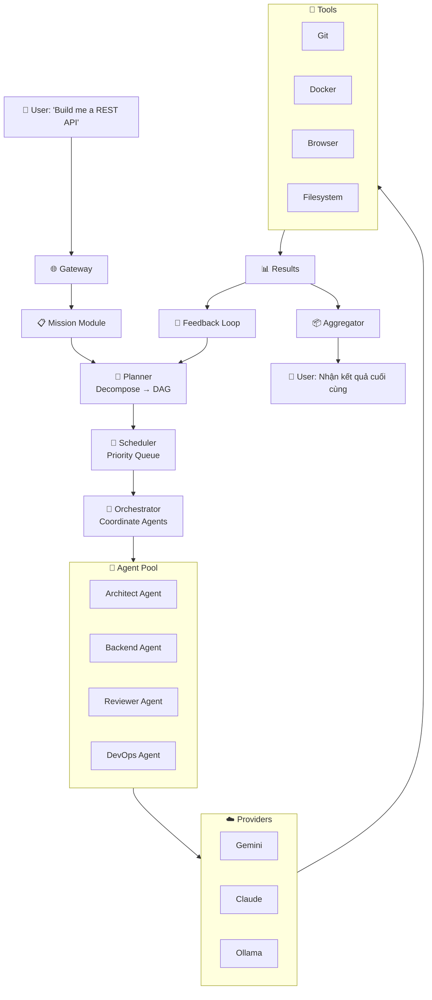

# 🏗️ Đánh Giá Kiến Trúc Orchestrator

## Mục tiêu hệ thống
> Bạn muốn một hệ thống **tự động điều phối các AI Agents** (Antigravity, Gemini, Claude, v.v.) để hoàn thành các nhiệm vụ phức tạp, và bạn **chỉ cần nhận kết quả cuối cùng**. Hệ thống phải hoạt động ổn định trong **10+ năm**.

---

## ✅ Điểm mạnh của kiến trúc hiện tại

| Thành phần | Đánh giá |
|---|---|
| **`kernel/`** — Tách riêng lõi hệ thống | ✅ Rất tốt. Kernel-based architecture giống Linux kernel, cho phép thay đổi mọi thứ bên ngoài mà không ảnh hưởng lõi. |
| **`contracts/`** — Interface-driven design | ✅ Xuất sắc. Đây là chìa khóa để hệ thống sống 10 năm. Mọi agent/provider/tool chỉ cần implement interface, không cần biết nhau. |
| **`plugins/`** — Plugin architecture | ✅ Tốt. Cho phép thêm/bớt agent, provider, tool mà không cần sửa code lõi. |
| **`sdk/`** — Developer Kit riêng | ✅ Tốt. Giúp bên thứ 3 hoặc chính bạn viết plugin mới dễ dàng. |
| **`modules/`** — Mission/Workspace/Session | ✅ Tốt. Tách biệt nghiệp vụ ra khỏi hạ tầng. |

---

## ⚠️ Những gì CÒN THIẾU để hệ thống tự động hoàn toàn trong 10 năm tới

### 1. 🧠 `kernel/planner/` — Bộ não lập kế hoạch (CRITICAL)

> [!CAUTION]
> **Đây là thành phần quan trọng nhất còn thiếu.** Không có Planner, hệ thống chỉ là một bộ chạy agent đơn lẻ, không phải orchestrator thực sự.

Planner chịu trách nhiệm:
- Nhận mission từ người dùng → Phân rã thành **DAG (Directed Acyclic Graph)** các sub-tasks
- Quyết định agent nào thực hiện task nào
- Xử lý **dependency giữa các tasks** (task B cần kết quả của task A)
- **Re-plan** khi một task thất bại

```
kernel/planner/
├── planner.go          # Core planner engine
├── decomposer.go       # Mission → sub-tasks decomposition
├── dag.go              # Task dependency graph
├── strategy.go         # Planning strategies (sequential, parallel, hybrid)
├── replanner.go        # Re-planning on failure
└── optimizer.go        # Plan optimization
```

---

### 2. 🔄 `kernel/orchestrator/` — Bộ điều phối chính (CRITICAL)

> [!CAUTION]
> Đây là "conductor" — người chỉ huy dàn nhạc. Nó kết nối Planner, Scheduler, Runtime, và Agents lại với nhau.

```
kernel/orchestrator/
├── orchestrator.go     # Main orchestration loop
├── coordinator.go      # Multi-agent coordination
├── pipeline.go         # Task pipeline management
├── supervisor.go       # Agent supervision & health check
├── aggregator.go       # Result aggregation from multiple agents
└── feedback.go         # Feedback loop for self-improvement
```

---

### 3. 🛡️ `kernel/resilience/` — Khả năng tự phục hồi (IMPORTANT)

> [!IMPORTANT]
> Nếu muốn hệ thống chạy 10 năm mà không cần can thiệp, **khả năng tự phục hồi là bắt buộc**.

```
kernel/resilience/
├── circuit_breaker.go  # Circuit breaker pattern cho các provider
├── retry.go            # Smart retry với exponential backoff
├── fallback.go         # Fallback sang provider/agent khác khi lỗi
├── timeout.go          # Timeout management
├── health.go           # Health check cho toàn bộ hệ thống
└── recovery.go         # Auto-recovery sau crash
```

---

### 4. 🔐 `kernel/security/` — Bảo mật & Quyền hạn (IMPORTANT)

> [!IMPORTANT]
> AI agents có quyền thực thi code, truy cập filesystem, chạy Docker, SSH... **Không có security layer = thảm họa.**

```
kernel/security/
├── permission.go       # Permission management cho agents
├── sandbox.go          # Sandboxed execution environment
├── audit.go            # Audit log mọi hành động của agent
├── policy.go           # Security policies
└── secrets.go          # Secret/credential management
```

---

### 5. 📊 `kernel/feedback/` — Vòng lặp phản hồi & Tự cải tiến (RECOMMENDED)

> [!NOTE]
> Đây là điều khiến hệ thống **thông minh hơn theo thời gian** thay vì chỉ lặp lại cùng một logic.

```
kernel/feedback/
├── evaluator.go        # Đánh giá chất lượng kết quả
├── scorer.go           # Scoring agents/providers theo hiệu suất
├── learner.go          # Học từ các mission trước đó
├── ranking.go          # Xếp hạng agent phù hợp nhất cho từng loại task
└── analytics.go        # Phân tích xu hướng và patterns
```

---

### 6. 🌐 `kernel/gateway/` — Cổng giao tiếp với bên ngoài (RECOMMENDED)

> [!NOTE]
> Khi hệ thống lớn lên, bạn sẽ cần một gateway thống nhất để nhận mission từ CLI, API, Web UI, hoặc thậm chí từ các orchestrator khác.

```
kernel/gateway/
├── gateway.go          # Unified entry point
├── grpc.go             # gRPC server cho inter-service communication
├── rest.go             # REST API gateway
├── websocket.go        # Real-time streaming kết quả
└── queue.go            # Message queue integration (NATS, Kafka)
```

---

### 7. 📦 `contracts/` — Cần bổ sung thêm interfaces

Thư mục `contracts/` hiện thiếu một số interface quan trọng:

```
contracts/
├── planner/            # ← MỚI: Interface cho Planner
├── orchestrator/       # ← MỚI: Interface cho Orchestrator
├── resilience/         # ← MỚI: Interface cho Circuit Breaker, Retry
├── security/           # ← MỚI: Interface cho Permission, Sandbox
├── gateway/            # ← MỚI: Interface cho Gateway
├── feedback/           # ← MỚI: Interface cho Feedback Loop
├── context/            # ← THIẾU trong contracts hiện tại
├── ... (giữ nguyên các thư mục hiện có)
```

---

## 🔁 Luồng xử lý Mission (End-to-End)

Đây là luồng hoàn chỉnh khi bạn gửi một yêu cầu và chỉ nhận kết quả cuối cùng:



---

## 📊 So sánh: Kiến trúc hiện tại vs Đề xuất

| Khả năng | Hiện tại | Đề xuất | Tầm quan trọng |
|---|:---:|:---:|:---:|
| Chạy agent đơn lẻ | ✅ | ✅ | — |
| Phân rã mission → sub-tasks | ❌ | ✅ `kernel/planner/` | 🔴 Critical |
| Điều phối multi-agent | ❌ | ✅ `kernel/orchestrator/` | 🔴 Critical |
| Tự phục hồi khi lỗi | ❌ | ✅ `kernel/resilience/` | 🟡 Important |
| Bảo mật agent execution | ❌ | ✅ `kernel/security/` | 🟡 Important |
| Tự cải tiến theo thời gian | ❌ | ✅ `kernel/feedback/` | 🟢 Recommended |
| Gateway thống nhất | ❌ | ✅ `kernel/gateway/` | 🟢 Recommended |
| Plugin architecture | ✅ | ✅ | — |
| Interface-driven design | ✅ | ✅ | — |

---

## 🗺️ Lộ trình triển khai đề xuất

### Phase 1: Foundation (Tuần 1-4)
- [ ] Thêm `kernel/planner/` và `kernel/orchestrator/`
- [ ] Thêm contracts tương ứng vào `contracts/`
- [ ] Viết kernel.go khởi tạo tất cả các thành phần

### Phase 2: Resilience & Security (Tuần 5-8)
- [ ] Thêm `kernel/resilience/` — circuit breaker, retry, fallback
- [ ] Thêm `kernel/security/` — permission, sandbox, audit

### Phase 3: Intelligence (Tuần 9-12)
- [ ] Thêm `kernel/feedback/` — evaluator, scorer, learner
- [ ] Thêm `kernel/gateway/` — REST, gRPC, WebSocket

### Phase 4: Polish & Scale (Tuần 13+)
- [ ] Monitoring dashboard (`web/`)
- [ ] CLI hoàn chỉnh (`cmd/orchestrator-cli/`)
- [ ] Documentation & Examples

---

## 💡 Kết luận

> [!IMPORTANT]
> Kiến trúc hiện tại của bạn có **nền tảng rất tốt** (kernel, contracts, plugins, sdk). Tuy nhiên, nó hiện đang thiếu **2 thành phần cốt lõi** để trở thành một orchestrator thực sự:
>
> 1. **`kernel/planner/`** — Bộ não phân rã nhiệm vụ
> 2. **`kernel/orchestrator/`** — Bộ điều phối multi-agent
>
> Không có 2 thành phần này, hệ thống chỉ là "một bộ chạy agent" chứ không phải "một bộ điều phối agent". Việc thêm resilience, security, feedback sẽ giúp hệ thống **tự vận hành và tự cải tiến trong 10+ năm**.

Bạn có muốn tôi tiến hành cập nhật cây thư mục theo đề xuất trên không?
