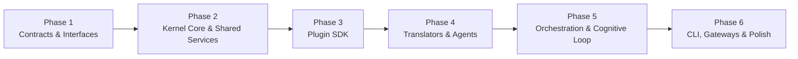

# 📋 AI Engineering Operating System (AEOS) Implementation Plan

## Overview

> **Goal**: Build **AEOS** — both a task coordinator (Orchestrator) and a Second Brain that learns from execution history. The system makes decisions independently using a deterministic Go Kernel. AI serves solely as a content-generation utility.
>
> **Language**: Go 1.26
>
> **Estimated Duration**: ~14-18 weeks
>
> **Philosophy**: Brain = Go Logic (Rule Engine + Knowledge Graph). AI = tool.

---

## Phase Dependency Diagram

---

## Phase 1: Contracts & Interfaces (Weeks 1-2)

> [!IMPORTANT]
> All contracts must remain independent and import only the standard library to guarantee backward compatibility and avoid import cycles.

### Task 1.1: Project Setup & FSM Contracts
- **Description**: Setup Go module, linters, and define the core Finite State Machine (FSM).
- **Files to create**:
  - `go.mod` — Module path: `github.com/tiendat1751998/orchestrator`
  - `contracts/fsm/machine.go` — Defines `Machine`, `State`, `Transition`, `TransitionRecord`.
  - `contracts/event/event.go` — Defines `Event`, `Bus`, `Handler`.
  - `contracts/mission/mission.go` — Defines `Mission` aggregate root structures.
- **Criteria**: `go build ./contracts/...` compiles successfully with no warnings.

### Task 1.2: Memory & Knowledge Contracts
- **Description**: Define persistent structures for semantic graph relationships and timeline loggers.
- **Files to create**:
  - `contracts/memory/memory.go` — `WorkingMemory` (mission-scoped active variables).
  - `contracts/knowledge/knowledge.go` — `KnowledgeGraph`, `NodeStore`, `EdgeStore`, `GraphQuerier`, `GraphStats`.
  - `contracts/artifact/artifact.go` — `ArtifactStore` and `Artifact` definitions.
  - `contracts/history/history.go` — `Timeline` event logger and `EntryIterator`.
- **Dependencies**: Task 1.1.
- **Duration**: 2 days.

### Task 1.3: Context & Brain Contracts
- **Description**: Define prompt pipeline gates and Brain cognitive engines.
- **Files to create**:
  - `contracts/brain/brain.go` — `Brain` facade.
  - `contracts/brain/decision.go` — `DecisionEngine`, `Situation`, `Decision`, `Rule`.
  - `contracts/brain/planning.go` — `PlanningEngine`, `Plan`, `PlanTemplate`, `TaskSpec`.
  - `contracts/brain/policy.go` — `PolicyEngine`, `PolicyAction`, `PolicyResult`.
  - `contracts/brain/context.go` — `ContextEngine`, `ContextRequest`, `AssembledContext`, `ContextBuilder`, `ContextRanker`, `ContextCompressor`.
  - `contracts/brain/cognitive.go` — `ReflectionEngine`, `LearningEngine`, `ExperienceEngine`, `PatternEngine`, `MetaThinkingController`.
- **Dependencies**: Task 1.2.
- **Duration**: 3 days.

### Task 1.4: Plugin & Provider Contracts
- **Description**: Define plugin registration ports and Provider translation layers.
- **Files to create**:
  - `contracts/plugin/plugin.go` — `Plugin`, `PluginMetadata` (lifecycle hooks).
  - `contracts/tool/tool.go` — `Tool`, `ToolSchema`.
  - `contracts/agent/agent.go` — `Agent` interfaces.
  - `contracts/provider/provider.go` — `Provider` base.
  - `contracts/provider/api.go` — `APIRequest`, `APIProvider`, `StreamingAPIProvider`.
  - `contracts/provider/cli.go` — `CLICommand`, `CLIProvider`, `CLIStreamProvider`.
- **Dependencies**: Task 1.3.
- **Duration**: 2 days.

### Task 1.5: Workspace Contracts
- **Description**: Define specifications for managing physical codebase environments (Workspace).
- **Files to create**:
  - `contracts/workspace/workspace.go` — `WorkspaceEngine`, `ProjectMetadata`, `GitDetails`, `BuildResult`.
- **Dependencies**: None.
- **Duration**: 1 day.

---

## Phase 2: Kernel Core & Shared Services (Weeks 3-6)

### Task 2.1: Kernel Setup & EventBus
- **Description**: Set up configuration parsers, structured logger, and EventBus.
- **Files to create**:
  - `kernel/config/` and `kernel/logger/` (slog structured logger).
  - `kernel/eventbus/` (in-memory pub/sub with wildcard topic support).
- **Duration**: 2 days.

### Task 2.2: Shared Storage Services
- **Description**: Implement SQLite adapters for the Knowledge Graph and Timeline History.
- **Files to create**:
  - `kernel/knowledge/storage/` — SQLite & filesystem adapters.
  - `kernel/knowledge/graph/` — Persistent graph database implementation.
  - `kernel/history/` — SQLite timeline logger and `EntryIterator`.
- **Dependencies**: Task 2.1, 1.2.
- **Criteria**: Nodes and Edges can be queried and traversed successfully using SQLite.

### Task 2.3: Plugin Runtime (Registry[T])
- **Description**: Implement generic registries for managing plugin lifecycles.
- **Files to create**:
  - `kernel/plugin/registry.go` — Thread-safe generic registry with automated capability indexing.
  - `kernel/plugin/lifecycle.go` — Configuration loading and boot triggers.
- **Dependencies**: Task 2.1, 1.4.
- **Duration**: 3 days.

### Task 2.4: Execution Runtime (Process & Resource Manager)
- **Description**: Implement process executors, OS isolation wrappers, and backpressure controllers.
- **Files to create**:
  - `kernel/execution/runtime.go` — Execution runtime lifecycles.
  - `kernel/execution/executor.go` — Task execution loops.
  - `kernel/execution/process/` — OS spawner capturing StdIO streams.
  - `kernel/execution/resource/` — Token bucket rate-limiting and host CPU/RAM monitors.
- **Dependencies**: Task 2.3.
- **Duration**: 4 days.

### Task 2.5: Brain Runtime & Context Engine
- **Description**: Implement decision engines and prompt compilation pipelines.
- **Files to create/modify**:
  - `kernel/brain/runtime.go` — Brain startup routines.
  - `kernel/brain/decision/` — Rule-based routing engine.
  - `kernel/brain/context/` — Context assemblers, AST rankers, and file compressors.
  - `kernel/brain/policy/` — Security guards evaluating absolute directory prefixes.
- **Dependencies**: Task 2.4.
- **Duration**: 5 days.

### Task 2.6: Workspace Engine
- **Description**: Implement workspace analyzer managing compiler toolchains and Git status checks.
- **Files to create**:
  - `kernel/workspace/detector.go` — Autodetects languages and parses module requirements.
  - `kernel/workspace/git.go` — Adapters for Git branch status checks.
  - `kernel/workspace/build.go` — Compilation toolchain triggers.
- **Dependencies**: Task 2.1, 1.5.
- **Duration**: 2.5 days.

### Task 2.7: Observation Runtime & Telemetry Collector
- **Description**: Implement the fourth runtime dedicated to background telemetry gathering.
- **Files to create**:
  - `kernel/observation/runtime.go` — Observation lifecycles.
  - `kernel/observation/collector.go` — Gathers AST changes, git diffs, test results.
  - `kernel/observation/analyzer.go` — Updates the Knowledge Platform asynchronously.
- **Dependencies**: Task 2.1.
- **Duration**: 3 days.

### Task 2.8: Workspace Snapshots & Deterministic Replay
- **Description**: Snapshot environments upon mission start to ensure identical replays.
- **Files to create**:
  - `kernel/workspace/snapshot.go` — Saves git commit, toolchain version, and dependencies.
  - `kernel/workspace/replay.go` — Restores snapshots for debugging.
- **Dependencies**: Task 2.6.
- **Duration**: 2 days.

---

## Phase 3: Plugin SDK (Weeks 7-8)

### Task 3.1: SDK — Plugin Base & Agent SDK
- **Description**: Build base structures for rapid plugin development.
- **Files to create**:
  - `sdk/plugin/` — Common plugin base helpers.
  - `sdk/agent/` — `BaseAgent` parsing YAML manifests and prompt templates.
- **Dependencies**: Task 2.3, 1.4.

### Task 3.2: SDK — Provider & Tool SDK
- **Description**: Implement request adapters and JSON schema validation helpers.
- **Files to create**:
  - `sdk/provider/` — API request builders and SSE stream parsing adapters.
  - `sdk/tool/` — Schema validator helpers.
- **Dependencies**: Task 1.4.
- **Duration**: 3 days.

---

## Phase 4: Translators & Agents (Weeks 9-11)

### Task 4.1: CLI & API Providers (Gemini / Antigravity)
- **Description**: Implement translators for Antigravity CLI processes and Gemini REST APIs.
- **Files to create**:
  - `plugins/providers/gemini/` — Implements `APIProvider` and `StreamingAPIProvider`.
  - `plugins/providers/antigravity/` — Implements `CLIProvider` and stream readers.
- **Dependencies**: Task 3.2.
- **Duration**: 5 days.

### Task 4.2: Tool Plugins (Git, Local FS, Shell Sandbox)
- **Description**: Implement system tools for filesystem modifications.
- **Files to create**:
  - `plugins/tools/filesystem/` — Reads and writes files securely matching allowed paths.
  - `plugins/tools/git/` — Triggers git commands.
- **Dependencies**: Task 3.2.
- **Duration**: 3 days.

### Task 4.3: Agent Plugins (Backend, DevOps, Reviewer)
- **Description**: Implement core agent plugins.
- **Files to create**:
  - `plugins/agents/backend/` — Generates endpoints, structures, and tests.
  - `plugins/agents/reviewer/` — Audits files for security rules.
- **Dependencies**: Task 3.1, 4.1, 4.2.
- **Duration**: 4 days.

---

## Phase 5: Orchestration & Cognitive Loop (Weeks 12-14)

### Task 5.1: K8s-Style Scheduler Controller
- **Description**: Implement multi-task scheduling queues, node affinity logic, and resource validation.
- **Files to create**:
  - `kernel/execution/scheduler/controller.go` — Loop executing task queues.
  - `kernel/execution/scheduler/queue.go` — Prioritized task structures.
- **Dependencies**: Task 2.4.
- **Criteria**: Tasks hold in queue if host resource limits (CPU > 85%) or API rate-limits are reached.

### Task 5.2: Self-Improving Cognitive Loop
- **Description**: Implement reflection routines, EMA scorecard calculations, pattern miners, and validation gates.
- **Files to create**:
  - `kernel/brain/cognitive/reflection.go` — Parses timelines and categorizes failures.
  - `kernel/brain/cognitive/learning.go` — Computes EMA score adjustments.
  - `kernel/brain/cognitive/experience.go` — Scores technology stack recipe performance.
  - `kernel/brain/cognitive/pattern.go` — Mines repository patterns (Saga, Outbox, Repository).
  - `kernel/brain/cognitive/metathinking.go` — Pre-validates plan structures for redundancies.
  - `kernel/brain/cognitive/truthpipeline.go` — Implements the 9-stage verification pipeline.
  - `kernel/brain/cognitive/skilltree.go` — Tracks agent capability evolution.
  - `kernel/brain/cognitive/dod.go` — Verifies Definition of Done parameters.
  - `kernel/brain/cognitive/cost.go` — Monitors AI budget execution costs.
  - `kernel/brain/cognitive/plancache.go` — Caches plan structures matching identical goals.
  - `kernel/brain/cognitive/adr.go` — Models ADR records and Policy Versioning selectors.
- **Dependencies**: Task 2.2, 2.5, 5.1.
- **Duration**: 8 days.

### Task 5.3: Container Sandboxing
- **Description**: Execute unverified tools inside temporary Docker containers.
- **Files to create**:
  - `kernel/execution/process/docker.go` — Docker client executors.
- **Dependencies**: Task 2.4.
- **Duration**: 3 days.

---

## Phase 6: CLI, Gateways & Polish (Weeks 15-18)

### Task 6.1: Unified Gateways
- **Description**: Implement WebSocket, REST, and gRPC endpoints.
- **Files to create**:
  - `kernel/gateway/rest.go`
  - `kernel/gateway/websocket.go` — Broadcasts real-time events to the UI.
- **Duration**: 4 days.

### Task 6.2: AEOS CLI
- **Description**: Build command-line interface controlling the system.
- **Files to create**:
  - `cmd/aeos/main.go`
  - Commands: `aeos run "mission"`, `aeos status`, `aeos knowledge`.
- **Duration**: 3 days.

---

## Phase 7: 57-RFC Extended Evolutionary Roadmap (Future)

> [!NOTE]
> This phase focuses on extending draft specifications RFC-0014 through RFC-0056 to ensure long-term system evolution.

### Task 7.1: Quality, DoD, HITL, Simulation, Canary Releases, Benchmarking & Time Travel
- **Description**: Code the multi-stage quality validations, DoD Engine, Human-In-The-Loop approval, dry-run FSM simulation, canary telemetry logs, policy simulation, planner benchmarking, and read-only time-travel debugging.
- **Related Drafts**: RFC-0014, RFC-0015, RFC-0034 (Advanced Quality), RFC-0036 (Mission Simulation), RFC-0043 (Release Intelligence), RFC-0049 (Benchmark Framework), RFC-0050 (Policy Simulator), RFC-0054 (Time Travel Debugging).

### Task 7.2: Telemetry, Goal/Intent, World Model, Budgeting, Economics, Decay & Trust
- **Description**: Integrate OpenTelemetry tracing, multi-agent message routing, local vector search, Goal/Intent Engine, World Model mapping, budget/cost planning, ROI economic engines, graph TTL decay metrics, and dynamically audited LLM trust engines.
- **Related Drafts**: RFC-0016, RFC-0017, RFC-0018, RFC-0022, RFC-0030 (Goal Engine), RFC-0031 (World Model), RFC-0032 (Skill Graph), RFC-0038 (Resource Planning), RFC-0040 (Intent Engine), RFC-0041 (Product Memory), RFC-0044 (Economic Engine), RFC-0051 (Knowledge Decay), RFC-0056 (Trust Engine).

### Task 7.3: OS Isolation, Confidence Guards, Skill Trees, PM Runtime, Workforce, DAG Merging, TX Workspace & Multi-Workspace
- **Description**: Implement sandboxing (Job Objects/Docker), dynamic loading (.so), Agent Skill Graphs, Confidence Engine routing, Planner Evolution rules, PM Agent routing, virtual employee competency models, execution DAG versioning, Git-backed workspace transaction stages, Prompt Registry, distributed mission event streaming, and multi-workspace submodule dependencies.
- **Related Drafts**: RFC-0019, RFC-0020 (Skill Metrics), RFC-0023, RFC-0033 (Confidence Engine), RFC-0035 (Capability Graph), RFC-0037 (Adaptive Recovery), RFC-0039 (Evolution Engine), RFC-0042 (PM Runtime), RFC-0045 (Digital Workforce), RFC-0046 (Execution Graph Manager), RFC-0047 (Workspace Transaction Engine), RFC-0048 (Prompt Registry), RFC-0052 (Distributed Mission), RFC-0053 (Artifact Lineage), RFC-0055 (Multi-Workspace).

### Task 7.4: AST Parsers & Audit Trails
- **Description**: Automated AST structural analysis, configuration encryption, and cryptographic audit logs.
- **Related Drafts**: RFC-0024, RFC-0025, RFC-0028.
