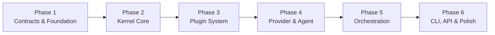

# 📋 Kế Hoạch Triển Khai Dự Án Orchestrator

## Tổng quan

> **Mục tiêu**: Xây dựng một hệ thống điều phối AI agents, cho phép người dùng giao một mission và nhận kết quả cuối cùng mà không cần can thiệp.
>
> **Ngôn ngữ**: Go
>
> **Provider chính**: Antigravity CLI/IDE (Gemini backend)
>
> **Thời gian ước lượng**: ~14-18 tuần

---

## Sơ đồ Dependency giữa các Phase

---

## Phase 1: Contracts & Foundation (Tuần 1-2)

> [!IMPORTANT]
> **Tại sao phải làm đầu tiên?** Contracts là "bản hợp đồng" giữa tất cả các thành phần. Mọi thứ khác đều phụ thuộc vào nó. Sai ở đây = sửa lại toàn bộ hệ thống.

### Task 1.1: Khởi tạo Go Module & Project Setup
- **Mô tả**: Tạo `go.mod`, `.gitignore`, cấu hình linter, Makefile
- **Files cần tạo**:
  - `go.mod` — Module path: `github.com/tiendat1751998/orchestrator`
  - `go.sum`
  - `.gitignore` — Ignore binary, vendor, IDE files
  - `Makefile` — Targets: build, test, lint, run
  - `.golangci.yml` — Linter configuration
- **Tiêu chí hoàn thành**: `go build ./...` chạy không lỗi
- **Thời gian**: 0.5 ngày

---

### Task 1.2: Contracts — Provider Interface
- **Mô tả**: Định nghĩa interface cho mọi AI provider (Antigravity, Gemini, Claude, v.v.)
- **Files cần tạo**:
  - `contracts/provider/provider.go` — Interface chính:
    - `Provider` interface: `Name()`, `Send()`, `Stream()`, `IsAvailable()`
    - `Request` struct: `SystemPrompt`, `Messages`, `Tools`, `Temperature`, `MaxTokens`
    - `Response` struct: `Content`, `ToolCalls`, `Usage`, `FinishReason`
    - `StreamChunk` struct: `Delta`, `Type`, `Done`
    - `ProviderConfig` struct: `APIKey`, `Model`, `BaseURL`, `Timeout`
- **Dependencies**: Không
- **Tiêu chí hoàn thành**: Interface đủ linh hoạt cho cả CLI-based provider (Antigravity) và API-based provider (Gemini API)
- **Thời gian**: 1 ngày

---

### Task 1.3: Contracts — Agent Interface
- **Mô tả**: Định nghĩa interface cho mọi agent (Backend, Frontend, Reviewer, v.v.)
- **Files cần tạo**:
  - `contracts/agent/agent.go` — Interface chính:
    - `Agent` interface: `Name()`, `Role()`, `Execute(task)`, `Capabilities()`
    - `AgentManifest` struct: `Name`, `Role`, `Description`, `Skills`, `Tools`, `Provider`
    - `AgentResult` struct: `Output`, `Artifacts`, `Status`, `Duration`, `Error`
    - `AgentStatus` enum: `Idle`, `Running`, `Completed`, `Failed`
- **Dependencies**: `contracts/provider`
- **Tiêu chí hoàn thành**: Interface hỗ trợ cả agent đơn giản (1 prompt → 1 response) và agent phức tạp (multi-turn conversation)
- **Thời gian**: 1 ngày

---

### Task 1.4: Contracts — Tool Interface
- **Mô tả**: Định nghĩa interface cho tools mà agents có thể sử dụng
- **Files cần tạo**:
  - `contracts/tool/tool.go` — Interface chính:
    - `Tool` interface: `Name()`, `Description()`, `Schema()`, `Execute(input)`
    - `ToolResult` struct: `Output`, `Error`, `ExitCode`
    - `ToolSchema` struct: JSON Schema cho input parameters
- **Dependencies**: Không
- **Tiêu chí hoàn thành**: Interface tương thích với function calling format của Gemini/OpenAI
- **Thời gian**: 0.5 ngày

---

### Task 1.5: Contracts — Workflow, Event, Memory, Search, Plugin, Context
- **Mô tả**: Định nghĩa interfaces cho các thành phần còn lại
- **Files cần tạo**:
  - `contracts/workflow/workflow.go` — `Workflow`, `Step`, `StepResult`
  - `contracts/event/event.go` — `Event`, `EventBus`, `Subscriber`, `Publisher`
  - `contracts/memory/memory.go` — `MemoryStore`: `Save()`, `Load()`, `Search()`, `Delete()`
  - `contracts/search/search.go` — `SearchEngine`: `Index()`, `Search()`, `Rank()`
  - `contracts/plugin/plugin.go` — `Plugin`: `Name()`, `Type()`, `Init()`, `Shutdown()`
  - `contracts/context/context.go` — `ContextBuilder`: `Build()`, `Compress()`, `Rank()`
  - `contracts/planner/planner.go` — `Planner`: `Plan(mission)`, `Replan(failure)`
  - `contracts/orchestrator/orchestrator.go` — `Orchestrator`: `Execute(mission)`, `Status()`
  - `contracts/resilience/resilience.go` — `CircuitBreaker`, `RetryPolicy`, `Fallback`
  - `contracts/security/security.go` — `PermissionManager`, `Sandbox`, `AuditLogger`
  - `contracts/gateway/gateway.go` — `Gateway`: `Start()`, `Stop()`, `Handle()`
  - `contracts/feedback/feedback.go` — `Evaluator`, `Scorer`, `Learner`
- **Dependencies**: Task 1.2, 1.3, 1.4
- **Tiêu chí hoàn thành**: `go build ./contracts/...` chạy không lỗi
- **Thời gian**: 2-3 ngày

---

### Task 1.6: Contracts — Shared Types & Errors
- **Mô tả**: Định nghĩa các kiểu dữ liệu và mã lỗi dùng chung
- **Files cần tạo**:
  - `contracts/types.go` — `TaskID`, `AgentID`, `ProviderID`, `SessionID`, `MissionID`
  - `contracts/errors.go` — `ErrProviderUnavailable`, `ErrAgentTimeout`, `ErrTaskFailed`, v.v.
  - `contracts/status.go` — `Status` enum: `Pending`, `Running`, `Success`, `Failed`, `Cancelled`
- **Dependencies**: Không
- **Tiêu chí hoàn thành**: Tất cả contracts sử dụng shared types thay vì primitive types
- **Thời gian**: 0.5 ngày

---

## Phase 2: Kernel Core (Tuần 3-5)

> [!IMPORTANT]
> **Tại sao phải làm thứ hai?** Kernel là "trái tim" của hệ thống. Không có kernel, plugins không có gì để gắn vào.

### Task 2.1: Kernel — Config & Logger
- **Mô tả**: Xây dựng hệ thống đọc cấu hình (YAML) và structured logging
- **Files cần tạo/sửa**:
  - `kernel/config/config.go` — Load config từ `.orchestrator/settings.yaml`
  - `kernel/config/loader.go` — YAML parser, environment variable override
  - `kernel/config/validator.go` — Validate config values
  - `kernel/logger/logger.go` — Structured logger (slog-based)
  - `kernel/logger/formatter.go` — JSON/Text output formatters
- **Dependencies**: Task 1.5 (contracts/config)
- **Tiêu chí hoàn thành**: Có thể load config YAML, override bằng env vars, log ra JSON
- **Thời gian**: 2 ngày

---

### Task 2.2: Kernel — EventBus
- **Mô tả**: Hệ thống pub/sub nội bộ để các thành phần giao tiếp với nhau mà không cần biết nhau
- **Files cần tạo/sửa**:
  - `kernel/eventbus/bus.go` — In-memory event bus
  - `kernel/eventbus/subscriber.go` — Subscriber management
  - `kernel/eventbus/publisher.go` — Event publishing
- **Dependencies**: Task 1.5 (contracts/event)
- **Tiêu chí hoàn thành**: Pub/sub hoạt động async, hỗ trợ wildcard topics, unit tests pass
- **Thời gian**: 1.5 ngày

---

### Task 2.3: Kernel — Registry
- **Mô tả**: Đăng ký và quản lý tất cả plugins (agents, providers, tools) lúc runtime
- **Files cần tạo/sửa**:
  - `kernel/registry/registry.go` — Plugin registry: `Register()`, `Get()`, `List()`, `Unregister()`
  - `kernel/registry/plugin.go` — Plugin lifecycle: `Init()`, `Start()`, `Stop()`
  - `kernel/registry/capability.go` — Capability matching: tìm agent phù hợp cho task
- **Dependencies**: Task 1.5 (contracts/plugin), Task 2.2 (eventbus)
- **Tiêu chí hoàn thành**: Có thể register/unregister plugin lúc runtime, query by capability
- **Thời gian**: 2 ngày

---

### Task 2.4: Kernel — Runtime & Executor
- **Mô tả**: Thực thi tasks, quản lý goroutines, context cancellation
- **Files cần tạo/sửa**:
  - `kernel/runtime/runtime.go` — Runtime engine
  - `kernel/runtime/executor.go` — Task executor (chạy 1 task trên 1 agent)
  - `kernel/runtime/manager.go` — Goroutine pool management
  - `kernel/runtime/dispatcher.go` — Dispatch task tới agent phù hợp
- **Dependencies**: Task 2.3 (registry), Task 2.2 (eventbus)
- **Tiêu chí hoàn thành**: Có thể thực thi task đồng thời, cancel an toàn, timeout handling
- **Thời gian**: 3 ngày

---

### Task 2.5: Kernel — Scheduler
- **Mô tả**: Quản lý hàng đợi ưu tiên, sắp xếp thứ tự thực thi tasks
- **Files cần tạo/sửa**:
  - `kernel/scheduler/scheduler.go` — Main scheduler loop
  - `kernel/scheduler/queue.go` — Priority queue implementation
  - `kernel/scheduler/priority.go` — Priority calculation strategies
- **Dependencies**: Task 2.4 (runtime)
- **Tiêu chí hoàn thành**: Tasks được xếp hàng theo priority, dependency order được tôn trọng
- **Thời gian**: 2 ngày

---

### Task 2.6: Kernel — Lifecycle & State
- **Mô tả**: Quản lý vòng đời hệ thống (startup → running → shutdown) và trạng thái
- **Files cần tạo/sửa**:
  - `kernel/lifecycle/lifecycle.go` — Lifecycle manager
  - `kernel/state.go` — Global state machine
  - `kernel/kernel.go` — Kernel bootstrap, wire tất cả components lại
- **Dependencies**: Tất cả tasks trong Phase 2
- **Tiêu chí hoàn thành**: Kernel khởi động được, graceful shutdown hoạt động
- **Thời gian**: 2 ngày

---

## Phase 3: Plugin System (Tuần 6-7)

> [!NOTE]
> Phase này biến kiến trúc từ "monolith" thành "pluggable". Sau phase này, thêm agent/provider/tool mới chỉ là thêm 1 plugin.

### Task 3.1: SDK — Agent SDK
- **Mô tả**: Cung cấp base struct và helper functions để viết agent plugin dễ dàng
- **Files cần tạo/sửa**:
  - `sdk/agent/agent.go` — `BaseAgent` struct, embed để tạo agent mới
  - `sdk/agent/manifest.go` — Load agent manifest từ YAML
  - `sdk/agent/lifecycle.go` — Default lifecycle hooks
- **Dependencies**: Task 1.3 (contracts/agent)
- **Tiêu chí hoàn thành**: Viết 1 agent mới chỉ cần <50 dòng code
- **Thời gian**: 2 ngày

---

### Task 3.2: SDK — Provider SDK
- **Mô tả**: Cung cấp base struct cho provider plugins
- **Files cần tạo/sửa**:
  - `sdk/provider/provider.go` — `BaseProvider` struct
  - `sdk/provider/request.go` — Request builder helpers
  - `sdk/provider/response.go` — Response parser helpers
  - `sdk/provider/stream.go` — Stream processing utilities
- **Dependencies**: Task 1.2 (contracts/provider)
- **Tiêu chí hoàn thành**: Viết 1 provider mới chỉ cần implement `Send()` và `Stream()`
- **Thời gian**: 2 ngày

---

### Task 3.3: SDK — Tool, Workflow, Context, Memory, Search, Plugin, Event, Task
- **Mô tả**: Cung cấp SDK cho các loại plugin còn lại
- **Files cần tạo/sửa**:
  - `sdk/tool/tool.go` — `BaseTool` struct
  - `sdk/tool/result.go` — Result builders
  - `sdk/workflow/workflow.go` — Workflow engine helpers
  - `sdk/context/builder.go` — Context builder utilities
  - `sdk/memory/memory.go` — Memory store helpers
  - `sdk/search/search.go` — Search engine helpers
  - `sdk/plugin/plugin.go` — Generic plugin helpers
  - `sdk/event/event.go` — Event helpers
  - `sdk/task/task.go` — Task definition helpers
- **Dependencies**: Task 1.5 (contracts)
- **Tiêu chí hoàn thành**: Mỗi loại plugin có base struct + helper functions
- **Thời gian**: 3 ngày

---

## Phase 4: Provider & Agent Plugins (Tuần 8-10)

> [!IMPORTANT]
> Đây là lúc hệ thống bắt đầu "sống". Sau phase này, orchestrator có thể giao tiếp với AI và thực thi tools.

### Task 4.1: Plugin — Antigravity Provider
- **Mô tả**: Implement provider plugin cho Antigravity CLI — **provider chính và duy nhất hiện tại**
- **Files cần tạo/sửa**:
  - `plugins/providers/antigravity/provider.go` — Implement `Provider` interface
  - `plugins/providers/antigravity/plugin.yaml` — Plugin metadata
  - `plugins/providers/antigravity/adapter/cli.go` — Gọi `antigravity` CLI process
  - `plugins/providers/antigravity/adapter/stdin.go` — Gửi prompt qua stdin
  - `plugins/providers/antigravity/adapter/stdout.go` — Đọc response từ stdout
  - `plugins/providers/antigravity/adapter/stderr.go` — Xử lý errors từ stderr
  - `plugins/providers/antigravity/parser/markdown.go` — Parse markdown response
  - `plugins/providers/antigravity/parser/toolcall.go` — Parse tool call blocks
  - `plugins/providers/antigravity/parser/json.go` — Parse JSON output
  - `plugins/providers/antigravity/parser/error.go` — Parse error messages
  - `plugins/providers/antigravity/session/manager.go` — Quản lý CLI sessions
  - `plugins/providers/antigravity/session/heartbeat.go` — Keep-alive
  - `plugins/providers/antigravity/prompt/builder.go` — Build prompts cho Antigravity format
- **Dependencies**: Task 3.2 (SDK Provider)
- **Tiêu chí hoàn thành**: Có thể gửi prompt tới Antigravity CLI và nhận response
- **Thời gian**: 5 ngày
- **Rủi ro**: Cần reverse-engineer Antigravity CLI protocol hoặc sử dụng Gemini API trực tiếp

---

### Task 4.2: Plugin — Core Tools (Git, Filesystem, Terminal)
- **Mô tả**: Implement các tools cơ bản mà agents cần để thao tác code
- **Files cần tạo/sửa**:
  - `plugins/tools/git/` — `git clone`, `git commit`, `git push`, `git diff`, `git log`
  - `plugins/tools/filesystem/` — `read_file`, `write_file`, `list_dir`, `search`
  - Tool SSH, Docker, Browser — placeholder cho Phase 6
- **Dependencies**: Task 3.3 (SDK Tool)
- **Tiêu chí hoàn thành**: Agent có thể đọc/ghi file, chạy git commands qua tools
- **Thời gian**: 3 ngày

---

### Task 4.3: Plugin — Core Agents (Backend, Architect, Reviewer)
- **Mô tả**: Implement 3 agents cốt lõi đầu tiên
- **Files cần tạo/sửa**:
  - `plugins/agents/backend/` — Backend agent: generate code, tests, API
    - `agent.yaml` — Manifest (name, role, capabilities, tools, provider)
    - `prompts/system.md` — System prompt
    - `prompts/generate_api.md` — Prompt template cho API generation
  - `plugins/agents/devops/` — DevOps agent: Dockerfile, K8s, CI/CD
  - `plugins/agents/reviewer/` — Code reviewer agent
- **Dependencies**: Task 3.1 (SDK Agent), Task 4.1 (Antigravity provider), Task 4.2 (Tools)
- **Tiêu chí hoàn thành**: Mỗi agent có thể nhận task → gọi provider → sử dụng tools → trả kết quả
- **Thời gian**: 4 ngày

---

## Phase 5: Orchestration Engine (Tuần 11-13)

> [!CAUTION]
> **Phase quan trọng nhất.** Đây là nơi biến "bộ sưu tập agents" thành "hệ thống điều phối tự động".

### Task 5.1: Kernel — Planner
- **Mô tả**: Xây dựng bộ não lập kế hoạch — phân rã mission thành DAG of tasks
- **Files cần tạo/sửa**:
  - `kernel/planner/planner.go` — Main planner (sử dụng AI để phân rã mission)
  - `kernel/planner/decomposer.go` — Mission → list of sub-tasks
  - `kernel/planner/dag.go` — Build dependency graph giữa các tasks
  - `kernel/planner/strategy.go` — Sequential vs Parallel vs Hybrid execution
  - `kernel/planner/replanner.go` — Re-plan khi task thất bại
  - `kernel/planner/optimizer.go` — Tối ưu plan (loại bỏ task redundant)
- **Cách hoạt động**:
  1. Nhận mission: "Build a REST API for user management"
  2. Gọi Antigravity với meta-prompt: "Phân rã nhiệm vụ này thành các sub-tasks"
  3. Parse response → tạo DAG: `design_api` → `implement_handlers` → `write_tests` → `review_code`
  4. Gán agent cho mỗi task: `Architect` → `Backend` → `Backend` → `Reviewer`
- **Dependencies**: Task 4.1 (Antigravity provider), Task 2.5 (Scheduler)
- **Tiêu chí hoàn thành**: Có thể phân rã mission phức tạp thành 5+ sub-tasks với dependency chính xác
- **Thời gian**: 5 ngày

---

### Task 5.2: Kernel — Orchestrator
- **Mô tả**: Bộ điều phối chính — kết nối Planner, Scheduler, Runtime, Agents
- **Files cần tạo/sửa**:
  - `kernel/orchestrator/orchestrator.go` — Main orchestration loop
  - `kernel/orchestrator/coordinator.go` — Multi-agent coordination
  - `kernel/orchestrator/pipeline.go` — Task pipeline: plan → schedule → execute → collect
  - `kernel/orchestrator/supervisor.go` — Monitor agent health, restart nếu cần
  - `kernel/orchestrator/aggregator.go` — Tổng hợp kết quả từ nhiều agents
  - `kernel/orchestrator/feedback.go` — Thu thập feedback cho vòng cải tiến
- **Cách hoạt động**:
  1. Nhận plan từ Planner (DAG of tasks)
  2. Đưa tasks vào Scheduler (priority queue)
  3. Scheduler gửi tasks tới Runtime/Executor
  4. Executor dispatch task tới Agent phù hợp
  5. Supervisor giám sát, Aggregator thu thập kết quả
  6. Khi tất cả tasks hoàn thành → trả kết quả cuối cùng cho user
- **Dependencies**: Task 5.1 (Planner), Task 2.4 (Runtime), Task 2.5 (Scheduler)
- **Tiêu chí hoàn thành**: End-to-end flow: mission → plan → execute → result hoạt động
- **Thời gian**: 5 ngày

---

### Task 5.3: Kernel — Resilience
- **Mô tả**: Đảm bảo hệ thống tự phục hồi khi gặp lỗi
- **Files cần tạo/sửa**:
  - `kernel/resilience/circuit_breaker.go` — Ngắt provider khi lỗi liên tục
  - `kernel/resilience/retry.go` — Exponential backoff retry
  - `kernel/resilience/fallback.go` — Chuyển sang provider/agent backup
  - `kernel/resilience/timeout.go` — Timeout management
  - `kernel/resilience/health.go` — Health checks cho providers & agents
  - `kernel/resilience/recovery.go` — Auto-recovery sau crash
- **Dependencies**: Task 5.2 (Orchestrator)
- **Tiêu chí hoàn thành**: Khi Antigravity CLI bị rate limit → retry 3 lần → nếu vẫn lỗi → thông báo rõ ràng
- **Thời gian**: 3 ngày

---

### Task 5.4: Kernel — Security
- **Mô tả**: Kiểm soát quyền hạn của agents
- **Files cần tạo/sửa**:
  - `kernel/security/permission.go` — Agent X được phép dùng tools nào
  - `kernel/security/sandbox.go` — Chạy tools trong môi trường cách ly
  - `kernel/security/audit.go` — Log toàn bộ hành động của agents
  - `kernel/security/policy.go` — Security policies (no delete /, no rm -rf, v.v.)
  - `kernel/security/secrets.go` — API key management
- **Dependencies**: Task 5.2 (Orchestrator), Task 2.3 (Registry)
- **Tiêu chí hoàn thành**: Agent không thể thực thi lệnh nguy hiểm, mọi hành động đều được log
- **Thời gian**: 3 ngày

---

## Phase 6: CLI, API & Polish (Tuần 14-18)

### Task 6.1: CLI — orchestrator-cli
- **Mô tả**: Giao diện dòng lệnh để người dùng tương tác với hệ thống
- **Files cần tạo/sửa**:
  - `cmd/orchestrator-cli/main.go` — Entry point
  - Commands:
    - `orchestrator mission "Build a REST API"` — Gửi mission
    - `orchestrator status` — Xem trạng thái mission hiện tại
    - `orchestrator agents list` — Liệt kê agents có sẵn
    - `orchestrator providers list` — Liệt kê providers
    - `orchestrator config` — Xem/sửa cấu hình
- **Dependencies**: Task 5.2 (Orchestrator)
- **Tiêu chí hoàn thành**: Gõ `orchestrator mission "..."` → hệ thống tự chạy → trả kết quả
- **Thời gian**: 3 ngày

---

### Task 6.2: API — REST/gRPC Gateway
- **Mô tả**: API server để tích hợp với Web UI hoặc hệ thống khác
- **Files cần tạo/sửa**:
  - `kernel/gateway/rest.go` — REST API endpoints
  - `kernel/gateway/grpc.go` — gRPC service definitions
  - `kernel/gateway/websocket.go` — Real-time streaming kết quả
  - `api/` — OpenAPI/Protobuf specs
- **Dependencies**: Task 5.2 (Orchestrator)
- **Tiêu chí hoàn thành**: `POST /api/v1/missions` → tạo mission → WebSocket stream kết quả
- **Thời gian**: 4 ngày

---

### Task 6.3: Modules — Mission, Workspace, Session
- **Mô tả**: Quản lý nghiệp vụ: lưu trữ missions, workspaces, sessions
- **Files cần tạo/sửa**:
  - `modules/mission/` — Mission CRUD, history, replay
  - `modules/workspace/` — Workspace management (project directory)
  - `modules/session/` — Session persistence, resume
  - `modules/artifact/` — Output artifacts management
  - `modules/execution/` — Execution history & logs
- **Dependencies**: Task 5.2 (Orchestrator)
- **Tiêu chí hoàn thành**: Mission history được lưu, có thể resume session sau crash
- **Thời gian**: 4 ngày

---

### Task 6.4: Feedback Loop & Metrics
- **Mô tả**: Hệ thống tự đánh giá và cải tiến
- **Files cần tạo/sửa**:
  - `kernel/feedback/evaluator.go` — Đánh giá chất lượng output
  - `kernel/feedback/scorer.go` — Score agents theo hiệu suất
  - `kernel/feedback/ranking.go` — Xếp hạng agent phù hợp cho từng loại task
  - `kernel/metrics/` — Prometheus-compatible metrics
- **Dependencies**: Task 5.2 (Orchestrator), Task 6.3 (Modules)
- **Tiêu chí hoàn thành**: Sau 10 missions, hệ thống tự biết agent nào giỏi task nào
- **Thời gian**: 3 ngày

---

### Task 6.5: Documentation & Examples
- **Mô tả**: Viết tài liệu và ví dụ sử dụng
- **Files cần tạo/sửa**:
  - `README.md` — Giới thiệu, cài đặt, quick start
  - `docs/` — Architecture docs, API docs, Plugin development guide
  - `examples/` — Ví dụ: tạo REST API, review code, deploy app
  - `CONTRIBUTING.md` — Hướng dẫn đóng góp
  - `CHANGELOG.md` — Nhật ký thay đổi
- **Dependencies**: Tất cả phases trước
- **Thời gian**: 2 ngày

---

## 📊 Tổng kết

| Phase | Tên | Thời gian | Số tasks |
|---|---|---|---|
| 1 | Contracts & Foundation | 2 tuần | 6 tasks |
| 2 | Kernel Core | 3 tuần | 6 tasks |
| 3 | Plugin System (SDK) | 2 tuần | 3 tasks |
| 4 | Provider & Agent Plugins | 3 tuần | 3 tasks |
| 5 | Orchestration Engine | 3 tuần | 4 tasks |
| 6 | CLI, API & Polish | 4 tuần | 5 tasks |
| **Tổng** | | **~17 tuần** | **27 tasks** |

---

## 🧪 Chiến lược kiểm thử

| Loại test | Khi nào | Công cụ |
|---|---|---|
| **Unit tests** | Mỗi task | Go `testing` package |
| **Integration tests** | Cuối mỗi Phase | `testcontainers-go` nếu cần |
| **End-to-end tests** | Phase 5+ | CLI-based E2E tests |
| **Benchmark** | Phase 2, 5 | Go `testing.B` |

---

## 🚦 Milestones chính

| Milestone | Khi nào | Ý nghĩa |
|---|---|---|
| 🟢 **M1: First Build** | Cuối Phase 1 | `go build ./...` thành công, contracts hoàn chỉnh |
| 🟢 **M2: Kernel Boots** | Cuối Phase 2 | Kernel khởi động, event bus hoạt động, graceful shutdown |
| 🟡 **M3: First Agent Call** | Cuối Phase 4 | Agent gọi Antigravity CLI thành công, trả về kết quả |
| 🔴 **M4: First Mission** | Cuối Phase 5 | Mission → Plan → Execute → Result hoạt động end-to-end |
| 🏆 **M5: Production Ready** | Cuối Phase 6 | CLI hoạt động, có resilience, security, metrics |

> [!TIP]
> **Gợi ý**: Bạn có thể dùng `/goal` command để giao từng task cho tôi thực hiện tự động. Ví dụ: "Implement Task 1.2: Contracts — Provider Interface"
