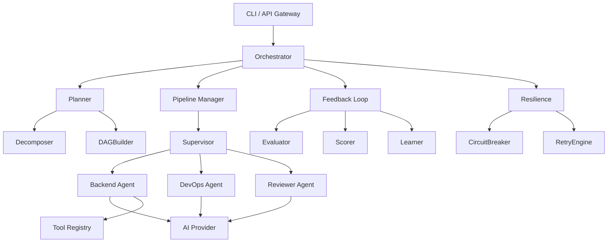

# Micro-Task 6.27: Create docs/architecture.md

## Info
- **File**: `docs/architecture.md`
- **Depends on**: All phases
- **Time**: 20 min
- **Verify**: Visual review

## Purpose
Comprehensive architecture documentation with Mermaid diagrams, component descriptions, data flow, and dependency graph.

## Key sections to include

### 1. System Overview Diagram (Mermaid)


### 2. Layer Architecture
| Layer | Package | Responsibility |
|-------|---------|---------------|
| **Contracts** | `contracts/` | Interface definitions, zero dependencies |
| **Kernel** | `kernel/` | Core engine, config, registry, event bus |
| **SDK** | `sdk/` | Plugin development kit |
| **Plugins** | `plugins/` | Concrete implementations |
| **Modules** | `modules/` | Persistence, workspace management |
| **CLI** | `cmd/` | User interface |

### 3. Data Flow
```
User Input → Mission → Decomposer → Task DAG → Pipeline → Agent Execution → Results → Feedback
```

### 4. Plugin Architecture
- All agents, providers, and tools register via `plugin.Registry`
- Plugins discovered at runtime via manifest YAML files
- Middleware chains wrap agents and providers for cross-cutting concerns

### 5. Concurrency Model
- Worker pool pattern for parallel task execution
- Mutex-protected shared state (registry, session, scorer)
- Context-based cancellation propagation
- Circuit breaker prevents cascade failures

## Checklist
- [ ] File `docs/architecture.md` exists
- [ ] System overview Mermaid diagram
- [ ] Layer architecture table
- [ ] Data flow description
- [ ] Plugin architecture explanation
- [ ] Concurrency model documentation
