# Phase 1 — Micro-Tasks Index

> Mỗi micro-task = 1 file duy nhất = 1 commit nhỏ.
> AI chỉ cần đọc 1 micro-task file và implement chính xác những gì được mô tả.

## Thứ tự thực hiện (PHẢI theo đúng thứ tự)

```mermaid
graph TD
    A["1.01 go.mod"] --> B["1.02 .gitignore"]
    B --> C["1.03 Makefile"]
    C --> D["1.04 .golangci.yml"]
    D --> E["1.05 contracts/errors.go"]
    E --> F["1.06 contracts/types.go"]
    F --> G["1.07 contracts/status.go"]
    G --> H["1.08 provider/message.go"]
    H --> I["1.09 provider/request.go"]
    I --> J["1.10 provider/response.go"]
    J --> K["1.11 provider/config.go"]
    K --> L["1.12 provider/provider.go"]
    L --> M["1.13 provider/provider_test.go"]
    M --> N["1.14 tool/schema.go"]
    N --> O["1.15 tool/tool.go"]
    O --> P["1.16 tool/tool_test.go"]
    P --> Q["1.17 agent/capability.go"]
    Q --> R["1.18 agent/task.go"]
    R --> S["1.19 agent/result.go"]
    S --> T["1.20 agent/manifest.go"]
    T --> U["1.21 agent/agent.go"]
    U --> V["1.22 agent/agent_test.go"]
    V --> W["1.23 event/event.go"]
    W --> X["1.24 plugin/plugin.go"]
    X --> Y["1.25 memory/memory.go"]
    Y --> Z["1.26 search/search.go"]
    Z --> AA["1.27 workflow/workflow.go"]
    AA --> AB["1.28 context/context.go"]
    AB --> AC["1.29 planner/planner.go"]
    AC --> AD["1.30 orchestrator/orchestrator.go"]
    AD --> AE["1.31 resilience/resilience.go"]
    AE --> AF["1.32 security/security.go"]
    AF --> AG["1.33 gateway/gateway.go"]
    AG --> AH["1.34 feedback/feedback.go"]
    AH --> AI["1.35 cmd/main.go skeleton"]
    AI --> AJ["1.36 verify: go build"]
```

## Danh sách Micro-Tasks

| # | File chi tiết | File target | Dependencies |
|---|---|---|---|
| 1.01 | [micro_1.01_go_mod.md](micro_1.01_go_mod.md) | `go.mod` | — |
| 1.02 | [micro_1.02_gitignore.md](micro_1.02_gitignore.md) | `.gitignore` | 1.01 |
| 1.03 | [micro_1.03_makefile.md](micro_1.03_makefile.md) | `Makefile` | 1.01 |
| 1.04 | [micro_1.04_golangci.md](micro_1.04_golangci.md) | `.golangci.yml` | 1.01 |
| 1.05 | [micro_1.05_errors.md](micro_1.05_errors.md) | `contracts/errors.go` | 1.01 |
| 1.06 | [micro_1.06_types.md](micro_1.06_types.md) | `contracts/types.go` | 1.05 |
| 1.07 | [micro_1.07_status.md](micro_1.07_status.md) | `contracts/status.go` | 1.05 |
| 1.08 | [micro_1.08_provider_message.md](micro_1.08_provider_message.md) | `contracts/provider/message.go` | 1.06 |
| 1.09 | [micro_1.09_provider_request.md](micro_1.09_provider_request.md) | `contracts/provider/request.go` | 1.08 |
| 1.10 | [micro_1.10_provider_response.md](micro_1.10_provider_response.md) | `contracts/provider/response.go` | 1.08 |
| 1.11 | [micro_1.11_provider_config.md](micro_1.11_provider_config.md) | `contracts/provider/config.go` | 1.06 |
| 1.12 | [micro_1.12_provider_interface.md](micro_1.12_provider_interface.md) | `contracts/provider/provider.go` | 1.09, 1.10, 1.11 |
| 1.13 | [micro_1.13_provider_test.md](micro_1.13_provider_test.md) | `contracts/provider/provider_test.go` | 1.12 |
| 1.14 | [micro_1.14_tool_schema.md](micro_1.14_tool_schema.md) | `contracts/tool/schema.go` | 1.06 |
| 1.15 | [micro_1.15_tool_interface.md](micro_1.15_tool_interface.md) | `contracts/tool/tool.go` | 1.14 |
| 1.16 | [micro_1.16_tool_test.md](micro_1.16_tool_test.md) | `contracts/tool/tool_test.go` | 1.15 |
| 1.17 | [micro_1.17_agent_capability.md](micro_1.17_agent_capability.md) | `contracts/agent/capability.go` | 1.06 |
| 1.18 | [micro_1.18_agent_task.md](micro_1.18_agent_task.md) | `contracts/agent/task.go` | 1.06, 1.07 |
| 1.19 | [micro_1.19_agent_result.md](micro_1.19_agent_result.md) | `contracts/agent/result.go` | 1.07, 1.10 |
| 1.20 | [micro_1.20_agent_manifest.md](micro_1.20_agent_manifest.md) | `contracts/agent/manifest.go` | 1.17 |
| 1.21 | [micro_1.21_agent_interface.md](micro_1.21_agent_interface.md) | `contracts/agent/agent.go` | 1.17, 1.18, 1.19 |
| 1.22 | [micro_1.22_agent_test.md](micro_1.22_agent_test.md) | `contracts/agent/agent_test.go` | 1.21 |
| 1.23 | [micro_1.23_event.md](micro_1.23_event.md) | `contracts/event/event.go` | 1.06 |
| 1.24 | [micro_1.24_plugin.md](micro_1.24_plugin.md) | `contracts/plugin/plugin.go` | 1.06 |
| 1.25 | [micro_1.25_memory.md](micro_1.25_memory.md) | `contracts/memory/memory.go` | 1.06 |
| 1.26 | [micro_1.26_search.md](micro_1.26_search.md) | `contracts/search/search.go` | 1.06 |
| 1.27 | [micro_1.27_workflow.md](micro_1.27_workflow.md) | `contracts/workflow/workflow.go` | 1.07, 1.18 |
| 1.28 | [micro_1.28_context.md](micro_1.28_context.md) | `contracts/context/context.go` | 1.06 |
| 1.29 | [micro_1.29_planner.md](micro_1.29_planner.md) | `contracts/planner/planner.go` | 1.18 |
| 1.30 | [micro_1.30_orchestrator.md](micro_1.30_orchestrator.md) | `contracts/orchestrator/orchestrator.go` | 1.07, 1.19 |
| 1.31 | [micro_1.31_resilience.md](micro_1.31_resilience.md) | `contracts/resilience/resilience.go` | 1.05 |
| 1.32 | [micro_1.32_security.md](micro_1.32_security.md) | `contracts/security/security.go` | 1.06 |
| 1.33 | [micro_1.33_gateway.md](micro_1.33_gateway.md) | `contracts/gateway/gateway.go` | 1.06 |
| 1.34 | [micro_1.34_feedback.md](micro_1.34_feedback.md) | `contracts/feedback/feedback.go` | 1.06 |
| 1.35 | [micro_1.35_cmd_main.md](micro_1.35_cmd_main.md) | `cmd/orchestrator/main.go` | 1.01 |
| 1.36 | [micro_1.36_verify.md](micro_1.36_verify.md) | — (verification only) | ALL |
