# Phase 2 — Micro-Tasks Index

> **Quy tắc bắt buộc**:
> - Kernel KHÔNG import từ `plugins/`. Chỉ import từ `contracts/`.
> - Mỗi micro-task = 1 file duy nhất, code CHÍNH XÁC copy-paste được.
> - Go version: **1.26**
> - Mỗi file phải có Godoc, error handling, và verify command.

## Dependency Rule

```
contracts/ ← kernel/ ← plugins/
              ↑ KHÔNG BAO GIỜ import plugins/
```

## Thứ tự thực hiện

```mermaid
graph TD
    A["2.01 config struct"] --> B["2.02 config defaults"]
    B --> C["2.03 config env resolver"]
    C --> D["2.04 config loader"]
    D --> E["2.05 config validator"]
    E --> F["2.06 config test"]
    F --> G["2.07 logger core"]
    G --> H["2.08 logger fields"]
    H --> I["2.09 logger formatter"]
    I --> J["2.10 logger redact"]
    J --> K["2.11 logger test"]
    K --> L["2.12 eventbus types"]
    L --> M["2.13 eventbus matcher"]
    M --> N["2.14 eventbus subscriber"]
    N --> O["2.15 eventbus bus"]
    O --> P["2.16 eventbus publisher helpers"]
    P --> Q["2.17 eventbus test"]
    Q --> R["2.18 registry core"]
    R --> S["2.19 registry agent finder"]
    S --> T["2.20 registry lifecycle"]
    T --> U["2.21 registry test"]
    U --> V["2.22 runtime executor"]
    V --> W["2.23 runtime worker pool"]
    W --> X["2.24 runtime dispatcher"]
    X --> Y["2.25 runtime engine"]
    Y --> Z["2.26 runtime test"]
    Z --> AA["2.27 scheduler queue"]
    AA --> AB["2.28 scheduler dependency tracker"]
    AB --> AC["2.29 scheduler core"]
    AC --> AD["2.30 scheduler test"]
    AD --> AE["2.31 kernel state"]
    AE --> AF["2.32 kernel bootstrap"]
    AF --> AG["2.33 kernel lifecycle"]
    AG --> AH["2.34 kernel test"]
    AH --> AI["2.35 verify all"]
```



## Danh sách Micro-Tasks (35 files)

### Config (6 tasks)
| # | File | Target | Thời gian |
|---|---|---|---|
| 2.01 | [micro_2.01_config_struct.md](micro_2.01_config_struct.md) | `kernel/config/config.go` | 20 min |
| 2.02 | [micro_2.02_config_defaults.md](micro_2.02_config_defaults.md) | `kernel/config/defaults.go` | 10 min |
| 2.03 | [micro_2.03_config_env.md](micro_2.03_config_env.md) | `kernel/config/env.go` | 15 min |
| 2.04 | [micro_2.04_config_loader.md](micro_2.04_config_loader.md) | `kernel/config/loader.go` | 20 min |
| 2.05 | [micro_2.05_config_validator.md](micro_2.05_config_validator.md) | `kernel/config/validator.go` | 20 min |
| 2.06 | [micro_2.06_config_test.md](micro_2.06_config_test.md) | `kernel/config/config_test.go` | 25 min |

### Logger (5 tasks)
| # | File | Target | Thời gian |
|---|---|---|---|
| 2.07 | [micro_2.07_logger_core.md](micro_2.07_logger_core.md) | `kernel/logger/logger.go` | 20 min |
| 2.08 | [micro_2.08_logger_fields.md](micro_2.08_logger_fields.md) | `kernel/logger/fields.go` | 10 min |
| 2.09 | [micro_2.09_logger_formatter.md](micro_2.09_logger_formatter.md) | `kernel/logger/formatter.go` | 15 min |
| 2.10 | [micro_2.10_logger_redact.md](micro_2.10_logger_redact.md) | `kernel/logger/redact.go` | 10 min |
| 2.11 | [micro_2.11_logger_test.md](micro_2.11_logger_test.md) | `kernel/logger/logger_test.go` | 20 min |

### EventBus (6 tasks)
| # | File | Target | Thời gian |
|---|---|---|---|
| 2.12 | [micro_2.12_eventbus_types.md](micro_2.12_eventbus_types.md) | `kernel/eventbus/types.go` | 10 min |
| 2.13 | [micro_2.13_eventbus_matcher.md](micro_2.13_eventbus_matcher.md) | `kernel/eventbus/matcher.go` | 15 min |
| 2.14 | [micro_2.14_eventbus_subscriber.md](micro_2.14_eventbus_subscriber.md) | `kernel/eventbus/subscriber.go` | 15 min |
| 2.15 | [micro_2.15_eventbus_bus.md](micro_2.15_eventbus_bus.md) | `kernel/eventbus/bus.go` | 25 min |
| 2.16 | [micro_2.16_eventbus_helpers.md](micro_2.16_eventbus_helpers.md) | `kernel/eventbus/helpers.go` | 10 min |
| 2.17 | [micro_2.17_eventbus_test.md](micro_2.17_eventbus_test.md) | `kernel/eventbus/bus_test.go` | 25 min |

### Registry (4 tasks)
| # | File | Target | Thời gian |
|---|---|---|---|
| 2.18 | [micro_2.18_registry_core.md](micro_2.18_registry_core.md) | `kernel/registry/registry.go` | 25 min |
| 2.19 | [micro_2.19_registry_finder.md](micro_2.19_registry_finder.md) | `kernel/registry/finder.go` | 15 min |
| 2.20 | [micro_2.20_registry_lifecycle.md](micro_2.20_registry_lifecycle.md) | `kernel/registry/lifecycle.go` | 20 min |
| 2.21 | [micro_2.21_registry_test.md](micro_2.21_registry_test.md) | `kernel/registry/registry_test.go` | 25 min |

### Runtime (5 tasks)
| # | File | Target | Thời gian |
|---|---|---|---|
| 2.22 | [micro_2.22_runtime_executor.md](micro_2.22_runtime_executor.md) | `kernel/runtime/executor.go` | 25 min |
| 2.23 | [micro_2.23_runtime_pool.md](micro_2.23_runtime_pool.md) | `kernel/runtime/pool.go` | 20 min |
| 2.24 | [micro_2.24_runtime_dispatcher.md](micro_2.24_runtime_dispatcher.md) | `kernel/runtime/dispatcher.go` | 15 min |
| 2.25 | [micro_2.25_runtime_engine.md](micro_2.25_runtime_engine.md) | `kernel/runtime/runtime.go` | 20 min |
| 2.26 | [micro_2.26_runtime_test.md](micro_2.26_runtime_test.md) | `kernel/runtime/runtime_test.go` | 25 min |

### Scheduler (4 tasks)
| # | File | Target | Thời gian |
|---|---|---|---|
| 2.27 | [micro_2.27_scheduler_queue.md](micro_2.27_scheduler_queue.md) | `kernel/scheduler/queue.go` | 20 min |
| 2.28 | [micro_2.28_scheduler_deps.md](micro_2.28_scheduler_deps.md) | `kernel/scheduler/deps.go` | 20 min |
| 2.29 | [micro_2.29_scheduler_core.md](micro_2.29_scheduler_core.md) | `kernel/scheduler/scheduler.go` | 20 min |
| 2.30 | [micro_2.30_scheduler_test.md](micro_2.30_scheduler_test.md) | `kernel/scheduler/scheduler_test.go` | 25 min |

### Kernel Bootstrap (5 tasks)
| # | File | Target | Thời gian |
|---|---|---|---|
| 2.31 | [micro_2.31_kernel_state.md](micro_2.31_kernel_state.md) | `kernel/state.go` | 15 min |
| 2.32 | [micro_2.32_kernel_bootstrap.md](micro_2.32_kernel_bootstrap.md) | `kernel/kernel.go` | 25 min |
| 2.33 | [micro_2.33_kernel_lifecycle.md](micro_2.33_kernel_lifecycle.md) | `kernel/lifecycle/lifecycle.go` | 15 min |
| 2.34 | [micro_2.34_kernel_test.md](micro_2.34_kernel_test.md) | `kernel/kernel_test.go` | 25 min |

### Production Hardening (5 tasks)
| # | File | Target | Thời gian |
|---|---|---|---|
| 2.36 | [micro_2.36_resilience.md](micro_2.36_resilience.md) | `kernel/resilience/` | 25 min |
| 2.37 | [micro_2.37_metrics.md](micro_2.37_metrics.md) | `kernel/metrics/metrics.go` | 20 min |
| 2.38 | [micro_2.38_dead_letter_queue.md](micro_2.38_dead_letter_queue.md) | `kernel/eventbus/dlq.go` | 20 min |
| 2.39 | [micro_2.39_config_watcher.md](micro_2.39_config_watcher.md) | `kernel/config/watcher.go` | 20 min |
| 2.40 | [micro_2.40_resilience_cleanup_enhancements.md](micro_2.40_resilience_cleanup_enhancements.md) | `kernel/runtime/` | 20 min |

### Final Verification (1 task)
| # | File | Target | Thời gian |
|---|---|---|---|
| 2.41 | [micro_2.35_verify.md](micro_2.35_verify.md) | — (verification only) | 15 min |

---

## Tổng kết

| Nhóm | Số tasks | Ước lượng |
|---|---|---|
| Config | 6 | 110 min |
| Logger | 5 | 75 min |
| EventBus | 6 | 100 min |
| Registry | 4 | 85 min |
| Runtime | 5 | 105 min |
| Scheduler | 4 | 85 min |
| Kernel Bootstrap | 4 | 80 min |
| Production Hardening | 5 | 105 min |
| Verification | 1 | 15 min |
| **Tổng** | **40** | **~12.6 giờ** |

## Cách sử dụng

```
Đọc file docs/tasks/phase2/micro_2.XX_name.md và implement CHÍNH XÁC
những gì được mô tả. Không thêm, không bớt. Sau đó chạy verify command.
```
