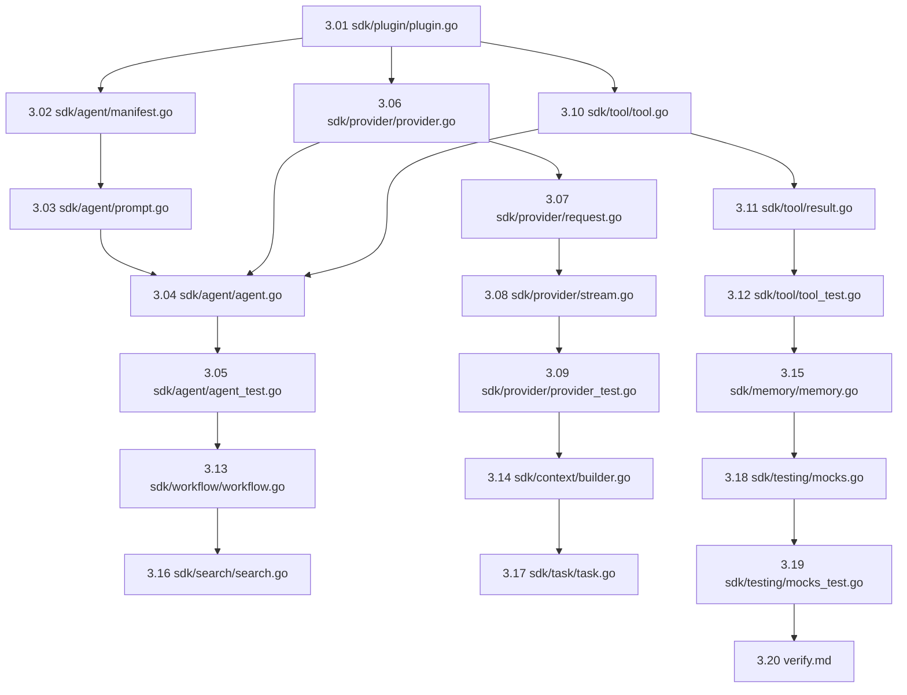

# Phase 3 — SDK (Developer Helpers) Micro-Tasks Index

> **Go Version**: `1.26.3`
> **Import Rules**:
> ```
> contracts/ ← kernel/ ← sdk/ ← plugins/
>                      ↑ NEVER imports plugins/ or api/
> ```
> Every micro-task must be implemented in a single file with Go documentation, concurrency safety, and verify commands.

## Dependency Graph



---

## Micro-Tasks List

### 1. Base & Configuration SDK (2 tasks)
| Task | File | Target | Description |
|---|---|---|---|
| 3.01 | [micro_3.01_base_plugin.md](micro_3.01_base_plugin.md) | `sdk/plugin/plugin.go` | Base lifecycle manager for generic plugin reuse. |
| 3.02 | [micro_3.02_manifest_loader.md](micro_3.02_manifest_loader.md) | `sdk/agent/manifest.go` | YAML manifest loader, template loader, and validation. |

### 2. Agent SDK (3 tasks)
| Task | File | Target | Description |
|---|---|---|---|
| 3.03 | [micro_3.03_prompt_builder.md](micro_3.03_prompt_builder.md) | `sdk/agent/prompt.go` | Format prompts, context items, and token-based boundaries. |
| 3.04 | [micro_3.04_base_agent.md](micro_3.04_base_agent.md) | `sdk/agent/agent.go` | Main BaseAgent loop with tool calling & error auto-correction. |
| 3.05 | [micro_3.05_agent_test.md](micro_3.05_agent_test.md) | `sdk/agent/agent_test.go` | Agent loop concurrency, timeouts, and iteration limits testing. |

### 3. Provider SDK (4 tasks)
| Task | File | Target | Description |
|---|---|---|---|
| 3.06 | [micro_3.06_base_provider.md](micro_3.06_base_provider.md) | `sdk/provider/provider.go` | Default provider base struct, mapping, and health check. |
| 3.07 | [micro_3.07_request_builder.md](micro_3.07_request_builder.md) | `sdk/provider/request.go` | Thread-safe, immutable fluent API for Request construction. |
| 3.08 | [micro_3.08_stream_collector.md](micro_3.08_stream_collector.md) | `sdk/provider/stream.go` | Stream chunk aggregator and context cancellation/drain helper. |
| 3.09 | [micro_3.09_provider_test.md](micro_3.09_provider_test.md) | `sdk/provider/provider_test.go` | Concurrency, streaming, and error mapping unit tests. |

### 4. Tool SDK (3 tasks)
| Task | File | Target | Description |
|---|---|---|---|
| 3.10 | [micro_3.10_base_tool.md](micro_3.10_base_tool.md) | `sdk/tool/tool.go` | BaseTool wrapping JSON Schema validations of parameters. |
| 3.11 | [micro_3.11_tool_result.md](micro_3.11_tool_result.md) | `sdk/tool/result.go` | Fluent results and system errors builders for tool execution. |
| 3.12 | [micro_3.12_tool_test.md](micro_3.12_tool_test.md) | `sdk/tool/tool_test.go` | Schema validation edge cases and failure checks testing. |

### 5. Support Skeletons SDK (6 tasks)
| Task | File | Target | Description |
|---|---|---|---|
| 3.13 | [micro_3.13_workflow_helper.md](micro_3.13_workflow_helper.md) | `sdk/workflow/workflow.go` | DAG task steps scheduler utility. |
| 3.14 | [micro_3.14_context_utilities.md](micro_3.14_context_utilities.md) | `sdk/context/builder.go` | Context builder helpers with token estimators. |
| 3.15 | [micro_3.15_memory_helpers.md](micro_3.15_memory_helpers.md) | `sdk/memory/memory.go` | Thread-safe conversation history storage buffer. |
| 3.16 | [micro_3.16_search_helpers.md](micro_3.16_search_helpers.md) | `sdk/search/search.go` | Local search engine query/index helpers. |
| 3.17 | [micro_3.17_task_builder.md](micro_3.17_task_builder.md) | `sdk/task/task.go` | Fluent Task builder API with validation. |
| 3.18 | [micro_3.18_testing_mocks.md](micro_3.18_testing_mocks.md) | `sdk/testing/mocks.go` | Mocks for Agent, Provider, Tool, and EventBus for plugin verification. |

### 6. Verification (2 tasks)
| Task | File | Target | Description |
|---|---|---|---|
| 3.19 | [micro_3.19_mocks_test.md](micro_3.19_mocks_test.md) | `sdk/testing/mocks_test.go` | Verify mock reliability and behavior injection. |
| 3.20 | [micro_3.20_verify.md](micro_3.20_verify.md) | — | Verification checklist, build & test validations. |

---

## Summary of Estimation

| Category | Tasks | Estimated Duration |
|---|---|---|
| Base & Config | 2 | 35 min |
| Agent SDK | 3 | 65 min |
| Provider SDK | 4 | 85 min |
| Tool SDK | 3 | 55 min |
| Support Skeletons | 6 | 100 min |
| Verification | 2 | 30 min |
| **Total** | **20** | **~6.2 hours** |
